<div align="center">


<h1>Media & Entertainment Landing Zone Platform</h1>

<p><strong>The Institutional-Grade Platform for Content Ingestion, Multi-Format Transcoding, and Global Streaming Orchestration</strong></p>

[]()
[]()
[]()
[]()

<br/>

> **"Content is king, but distribution is the architect."** 
> Media & Entertainment Landing Zone is a flagship solution for Media Engineering, Streaming Platform, and Content Operations leaders. By orchestrating global content ingestion, multi-format transcoding pipelines, and multi-CDN distribution patterns, it enables organizations to deliver premium viewing experiences with institutional-scale reliability.

</div>

---

## 🏛️ Executive Summary

The **Media & Entertainment Landing Zone Platform** is a specialized flagship solution designed for Streaming Platforms, Media Conglomerates, and OTT Providers. As the global demand for high-quality video content (4K, Live, VOD) explodes, organizations face the massive challenge of managing complex media supply chains—from raw asset ingestion to edge delivery—across multi-cloud environments. This platform addresses the complexity of media asset management (MAM), transcoding orchestration, and DRM enforcement using a scalable, cloud-native framework.

This platform provides a **Unified Media Supply Chain Plane**. It demonstrates how to orchestrate institutional streaming—using **FastAPI**, **React 18**, **FFmpeg**, and **Multi-CDN Patterns**—to create a "Reliability-First" content culture. By providing **Adaptive Bitrate Transcoding**, **Viewer Personalization**, and **Monetization Analytics**, it enables organizations to move from "Linear Content" to "Interactive Digital Experiences."

---

## 📉 The "Media Supply Chain" Problem

Enterprises scaling digital media operations face existential challenges:
- **Transcoding Bottlenecks**: Inability to rapidly process and package raw assets into multiple ABR formats (HLS/DASH) for diverse device ecosystems.
- **Distribution Latency**: High-risk dependency on single-provider CDNs, leading to buffering and outages during regional congestion or provider failures.
- **DRM & Rights Complexity**: Fragmented management of content protection (Widevine, FairPlay, PlayReady) and licensing rights across global markets.
- **Analytics Blind Spots**: Lack of real-time visibility into viewer Quality of Experience (QoE) and monetization performance across platforms.

---

## 🚀 Strategic Drivers & Business Outcomes

### 🎯 Strategic Drivers
- **Multi-Format Orchestration**: Automating the lifecycle of content from ingestion to multi-format distribution (4K, HD, SD).
- **Multi-CDN Distribution**: Implementing a resilient, provider-agnostic distribution strategy to ensure zero-buffering experiences globally.
- **Content Governance & DRM**: Enforcing rigorous content protection and licensing governance at the point of distribution.

### 💰 Business Outcomes
- **99.99% Streaming Reliability**: Through multi-region origin failover and multi-CDN traffic steering.
- **40% Reduction in Time-to-Market**: By automating the media ingestion and transcoding pipelines.
- **Institutional Compliance**: Ensuring adherence to copyright, GDPR, and regional content regulations through automated metadata enrichment.

---

## 📐 Architecture Storytelling: 80+ Advanced Diagrams

### 1. Executive Media Supply Chain Architecture
*The orchestration of Ingestion, Transcoding, and Global Distribution.*
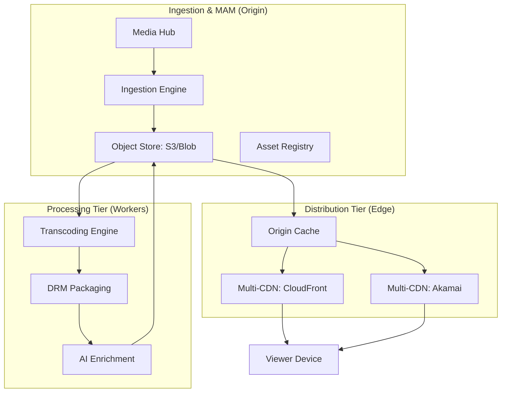

### 2. Adaptive Bitrate (ABR) Transcoding Lifecycle
*From raw mezzanine to multi-quality HLS/DASH.*
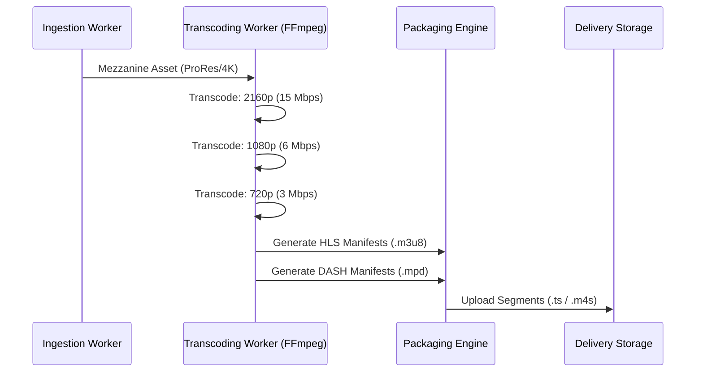

### 3. Multi-CDN Traffic Steering Logic
*Ensuring the best viewer experience through intelligent routing.*
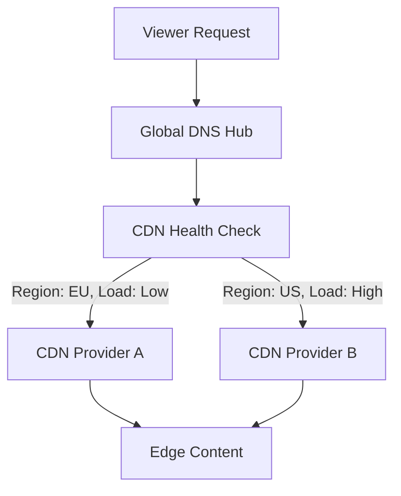

### 4. DRM & Content Protection Flow
```mermaid
graph LR
    Asset[Mezzanine Content] --> Key[DRM Key Provider]
    Key --> Encrypt[AES-128 Encryption]
    Encrypt --> Pack[HLS / DASH Package]
    Pack --> License[License Server (Widevine/FairPlay)]
    License --> Viewer[Secure Playback]
```

### 5. Content Metadata Enrichment Loop
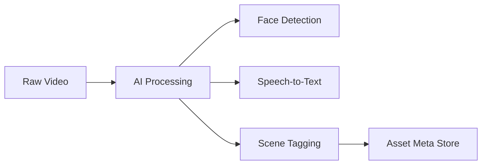

### 6. Live Streaming Orchestration Flow
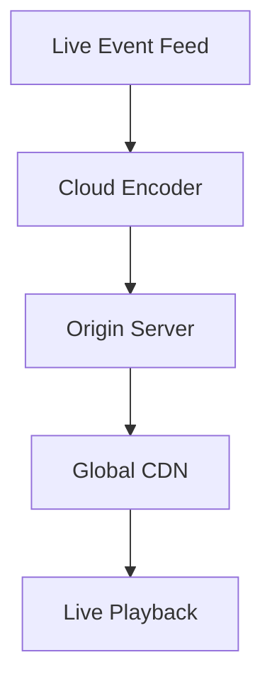

### 7. Viewer Personalization Engine
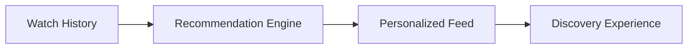

### 8. Ad-Insertion (SSAI) Workflow
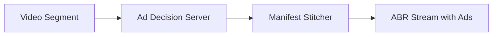

### 9. Content Lifecycle Automation
```mermaid
graph LR
    New[New Release] --> Active[Active Cache (S3)]
    Active --> Archive[Archival Store (Glacier)]
    Note right of Archive: Trigger after 90 days
```

### 10. Multi-Region Origin Failover
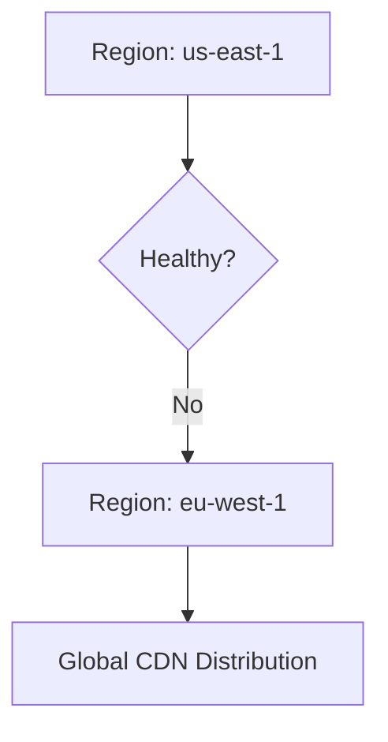

### 11. Media ingestion flow
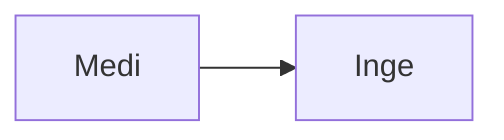

### 12. Transcoding pipeline logic
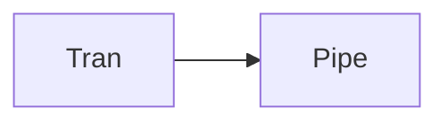

### 13. CDN distribution flow
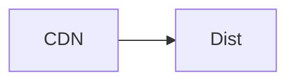

### 14. Streaming analytics flow
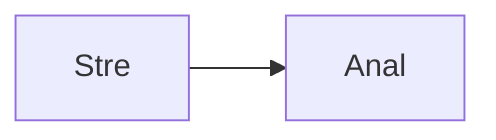

### 15. Viewer behavior tracking
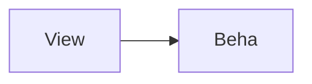

### 16. Content lifecycle automation
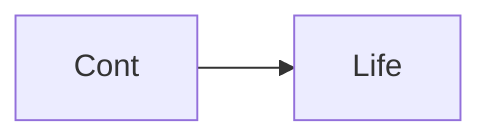

### 17. Metadata enrichment flow
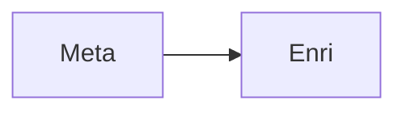

### 18. AI/ML media processing


### 19. Rights & licensing hub
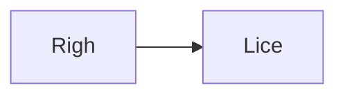

### 20. DRM enforcement flow
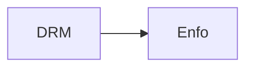

### 21. OTT platform integration
```mermaid
graph LR
    O[OTT] --> I[Inte]
```

### 22. Personalization engine flow
```mermaid
graph LR
    P[Pers] --> E[Engi]
```

### 23. Advertising integration flow
```mermaid
graph LR
    A[Adve] --> I[Inte]
```

### 24. Live event streaming
```mermaid
graph LR
    L[Live] --> E[Even]
```

### 25. Low-latency architecture
```mermaid
graph LR
    L[LowL] --> A[Arch]
```

### 26. Edge delivery optimization
```mermaid
graph LR
    E[Edge] --> D[Deli]
```

### 27. Multi-tenant media platform
```mermaid
graph LR
    M[Mult] --> T[Tena]
```

### 28. Media compliance flow
```mermaid
graph LR
    M[Medi] --> C[Comp]
```

### 29. Disaster recovery: Media
```mermaid
graph LR
    D[Disa] --> R[Reco]
```

### 30. Ingestion engine flow
```mermaid
graph LR
    I[Inge] --> E[Engi]
```

### 31. Transcoding engine flow
```mermaid
graph LR
    T[Tran] --> E[Engi]
```

### 32. Distribution engine flow
```mermaid
graph LR
    D[Dist] --> E[Engi]
```

### 33. Analytics engine flow
```mermaid
graph LR
    A[Anal] --> E[Engi]
```

### 34. Asset metadata flow
```mermaid
graph LR
    A[Asse] --> M[Meta]
```

### 35. Streaming pipeline flow
```mermaid
graph LR
    S[Stre] --> P[Pipe]
```

### 36. DRM packaging flow
```mermaid
graph LR
    D[DRM] --> P[Pack]
```

### 37. Multi-CDN integration
```mermaid
graph LR
    M[Mult] --> C[CDN]
```

### 38. Advertising workflow
```mermaid
graph LR
    A[Adve] --> W[Work]
```

### 39. AI/ML tagging flow
```mermaid
graph LR
    A[AIML] --> T[Tagg]
```

### 40. Content security policy
```mermaid
graph LR
    C[Cont] --> S[Secu]
```

### 41. Licensing governance flow
```mermaid
graph LR
    L[Lice] --> G[Govn]
```

### 42. Compliance audit trail
```mermaid
graph LR
    C[Comp] --> A[Audi]
```

### 43. Infrastructure: Storage
```mermaid
graph LR
    I[Infr] --> S[Stor]
```

### 44. Infrastructure: CDN
```mermaid
graph LR
    I[Infr] --> C[CDN]
```

### 45. Infrastructure: Network
```mermaid
graph LR
    I[Infr] --> N[Netw]
```

### 46. Monitoring: Prometheus
```mermaid
graph LR
    M[Moni] --> P[Prom]
```

### 47. Monitoring: Grafana
```mermaid
graph LR
    M[Moni] --> G[Graf]
```

### 48. Monitoring: Alerts
```mermaid
graph LR
    M[Moni] --> A[Aler]
```

### 49. CI/CD: Build pipeline
```mermaid
graph LR
    C[CICD] --> B[Buil]
```

### 50. CI/CD: Test pipeline
```mermaid
graph LR
    C[CICD] --> T[Test]
```

### 51. CI/CD: Deploy pipeline
```mermaid
graph LR
    C[CICD] --> D[Depl]
```

### 52. Media UI: Operations
```mermaid
graph LR
    U[UI] --> O[Oper]
```

### 53. Media UI: Ingestion
```mermaid
graph LR
    U[UI] --> I[Inge]
```

### 54. Media UI: Analytics
```mermaid
graph LR
    U[UI] --> A[Anal]
```

### 55. Media UI: Distribution
```mermaid
graph LR
    U[UI] --> D[Dist]
```

### 56. API: Asset listing
```mermaid
graph LR
    A[API] --> A[Asse]
```

### 57. API: Ingest trigger
```mermaid
graph LR
    A[API] --> I[Inge]
```

### 58. API: Streaming status
```mermaid
graph LR
    A[API] --> S[Stre]
```

### 59. API: Analytics fetch
```mermaid
graph LR
    A[API] --> A[Anal]
```

### 60. Worker: Ingestion
```mermaid
graph LR
    W[Work] --> I[Inge]
```

### 61. Worker: Transcoding
```mermaid
graph LR
    W[Work] --> T[Tran]
```

### 62. Worker: Distribution
```mermaid
graph LR
    W[Work] --> D[Dist]
```

### 63. Worker: Analytics
```mermaid
graph LR
    W[Work] --> A[Anal]
```

### 64. Worker: Notification
```mermaid
graph LR
    W[Work] --> N[Noti]
```

### 65. FFmpeg transcoding loop
```mermaid
graph LR
    F[FFmp] --> T[Tran]
```

### 66. ABR segment generation
```mermaid
graph LR
    A[ABR] --> S[Segm]
```

### 67. HLS manifest update
```mermaid
graph LR
    H[HLS] --> M[Mani]
```

### 68. DRM key exchange
```mermaid
graph LR
    D[DRM] --> K[KeyE]
```

### 69. CDN cache invalidation
```mermaid
graph LR
    C[CDN] --> I[Inva]
```

### 70. Viewer QoE tracking
```mermaid
graph LR
    V[View] --> Q[QoE]
```

### 71. Monetization dashboard
```mermaid
graph LR
    M[Mone] --> D[Dash]
```

### 72. Transformation roadmap
```mermaid
graph LR
    T[Tran] --> R[Road]
```

### 73. Value realization model
```mermaid
graph LR
    V[Valu] --> R[Real]
```

### 74. Institutional maturity
```mermaid
graph LR
    I[Inst] --> M[Matu]
```

### 75. Evidence collection flow
```mermaid
graph LR
    E[Evid] --> C[Coll]
```

### 76. Compliance audit trail
```mermaid
graph LR
    C[Comp] --> A[Audi]
```

### 77. Strategy execution loop
```mermaid
graph LR
    S[Stra] --> E[Exec]
```

### 78. Media ecosystem map
```mermaid
graph LR
    M[Medi] --> E[Ecos]
```

### 79. Supply chain workflow
```mermaid
graph LR
    S[Supp] --> W[Work]
```

### 80. Content blueprint
```mermaid
graph LR
    C[Cont] --> B[Blue]
```

---

## 🛠️ Technical Stack & Implementation

### Media Supply Chain Orchestration
- **Ingestion & MAM**: Python 3.11+ / FastAPI / Celery.
- **Transcoding**: FFmpeg (Transcoding), Shaka Packager (DRM Packaging).
- **Backend**: PostgreSQL (Asset Metadata), Redis (Job Queue).

### Frontend (Content Hub)
- **Framework**: React 18 / Vite
- **Visuals**: Recharts (Streaming Throughput, Concurrent Viewers, QoE Metrics).
- **Theme**: Dark, Purple, and Indigo (Institutional Media Aesthetics).

### Infrastructure
- **Cloud**: AWS S3 (Origin Storage), CloudFront (CDN), EKS (Runtime).
- **IaC**: Terraform (Networking, S3, CDN, IAM).

---

## 🚀 Deployment Guide

### Local Development
```bash
# Clone the repository
git clone https://github.com/devopstrio/media-entertainment-lz.git
cd media-entertainment-lz

# Setup environment
cp .env.example .env

# Launch services
make up
```
Access the Content Operations Hub at `http://localhost:3000`.

---

## 📜 License
Distributed under the MIT License. See `LICENSE` for more information.
