<div align="center">


<h1>Media & Entertainment Landing Zone</h1>

<p><strong>The Institutional-Grade Platform for Content Ingestion, Multi-Format Transcoding, and Global Streaming Orchestration.</strong></p>

[]()
[]()
[]()

<br/>

> **"Content is king, but distribution is the architect."** 
> **Media & Entertainment Landing Zone** is an enterprise-grade platform designed to provide a secure, measurable, and highly automated foundation for global media operations. It orchestrates the complex lifecycle of content—from high-performance ingestion and distributed transcoding to secure edge delivery and unified media governance.

</div>

---

## 🏛️ Executive Summary

Fragmented media assets and manual transcoding workflows are strategic operational liabilities; lack of centralized media orchestration is a primary barrier to organizational content scaling. Organizations fail to achieve rapid media delivery not because of a lack of creativity, but because of fragmented data standards, lack of automated supply chain planning, and an inability to orchestrate media assets with operational precision.

This platform provides the **Content Intelligence Plane**. It implements a complete **Enterprise Media-as-Code Framework**, enabling Media Engineering and Operations teams to manage global content lifecycles as first-class citizens. By automating the ingestion of high-fidelity mezzanine files and orchestrating real-time DRM packaging, we ensure that every organizational asset—from live sports broadcasts to 4K VOD libraries—is processed by default, audited for history, and strictly aligned with institutional digital rights management frameworks.

---

## 📐 Architecture Storytelling: Principal Reference Models

### 1. Principal Architecture: Global Media & Entertainment Landing Zone & Content Intelligence Plane
This diagram illustrates the end-to-end flow from high-performance ingestion and automated transcoding to DRM packaging, global edge delivery, and institutional media auditing.

```mermaid
graph LR
    %% Subgraph Definitions
    subgraph ContentIngestion["High-Performance Content Ingress"]
        direction TB
        DirectConnect["Direct Connect / ExpressRoute"]
        S3Bucket["Raw Mezzanine Storage (S3)"]
        UploadPortal["Production Upload Portal"]
    end

    subgraph IntelligenceEngine["Content Intelligence Hub"]
        direction TB
        API["FastAPI Media Gateway"]
        MAM["Media Asset Manager (MAM)"]
        TranscodeOrch["Transcoding Orchestrator"]
        DRMPackager["DRM & Packaging Engine"]
    end

    subgraph ProcessingPlane["Distributed Processing Fleet"]
        direction TB
        RenderingFarm["Distributed Rendering Farm"]
        TranscodeWorkers["FFmpeg Transcode Workers"]
        AITagging["AI Content Tagging Bot"]
    end

    subgraph OperationsHub["Institutional Media Hub"]
        direction TB
        Scorecard["Media Maturity Score"]
        Analytics["Ingestion & Delivery Stats"]
        Audit["Forensic Media Metadata Lake"]
    end

    subgraph DevOps["Media-as-Code Orchestration"]
        direction TB
        TF["Terraform Media Modules"]
        CDNConfig["Multi-CDN Traffic Steering"]
        ChatOps["Release Approval Hub"]
    end

    %% Flow Arrows
    ContentIngestion -->|1. Submit Mezzanine| API
    API -->|2. Register Asset| MAM
    MAM -->|3. Trigger Transcode| TranscodeOrch
    TranscodeOrch -->|4. Orchestrate Rendering| ProcessingPlane
    
    ProcessingPlane -->|5. Package Content| DRMPackager
    DRMPackager -->|6. Deliver to Edge| ChatOps
    API -->|7. Visualize Health| Scorecard
    
    Scorecard -->|8. Track QoE| Analytics
    Scorecard -->|9. Record Event| Audit
    
    TF -->|10. Provision Hub| IntelligenceEngine
    CDNConfig -->|11. Route Traffic| ChatOps
    Audit -->|12. Improve Models| TranscodeOrch

    %% Styling
    classDef ingress fill:#f5f5f5,stroke:#616161,stroke-width:2px;
    classDef intel fill:#ede7f6,stroke:#311b92,stroke-width:2px;
    classDef processing fill:#e1f5fe,stroke:#01579b,stroke-width:2px;
    classDef ops fill:#ede7f6,stroke:#311b92,stroke-width:2px;
    classDef devops fill:#e8f5e9,stroke:#1b5e20,stroke-width:2px;

    class ContentIngestion ingress;
    class IntelligenceEngine intel;
    class ProcessingPlane processing;
    class OperationsHub ops;
    class DevOps devops;
```

### 2. The Media Supply Chain Lifecycle Flow
The continuous path of a media asset from initial ingestion and processing to active transcoding, packaging, delivery, and institutional forensic auditing.

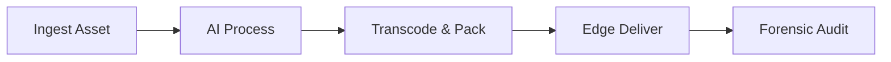

### 3. High-Performance Content Ingestion Topology
Strategically receiving large raw media mezzanine files via dedicated low-latency pathways (Direct Connect / ExpressRoute) to ensure production deadlines are met without public internet jitter.

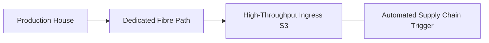

### 4. Distributed Transcoding & Rendering Farm Flow
Orchestrating large-scale rendering and transcoding tasks across distributed spot instance fleets, maximizing throughput while minimizing compute unit costs for 4K/8K content.

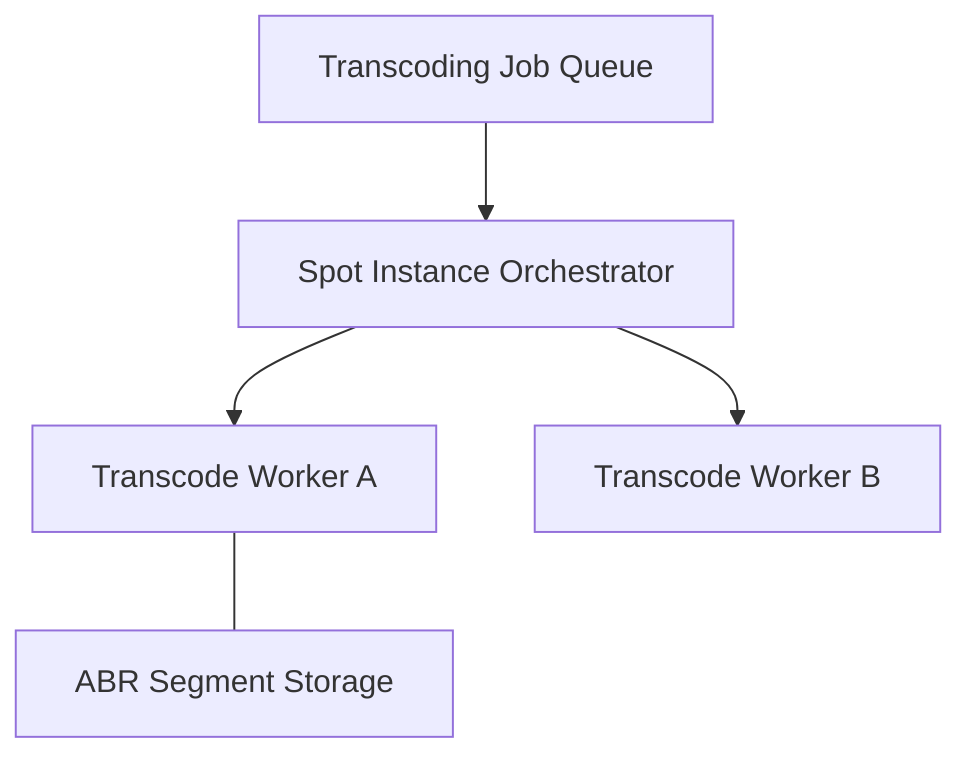

### 5. Digital Asset Management (DAM) & Metadata Flow
Automatically categorizing and indexing high-volume media assets with AI-generated metadata (tags, facial recognition, speech-to-text) to enable instant institutional search.

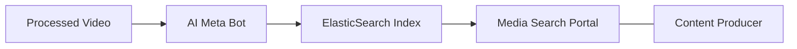

### 6. Edge Content Delivery (CDN) & DRM Flow
Securing and delivering content globally through multi-CDN traffic steering and real-time DRM (Widevine, FairPlay) license enforcement at the viewing point.

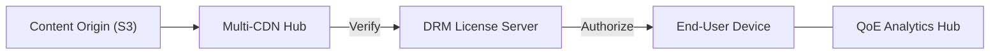

### 7. Institutional Media Maturity Scorecard
Grading organizational performance based on key indicators: Ingestion-to-Live Latency, Transcoding Cost ROI, and Delivery Uptime.

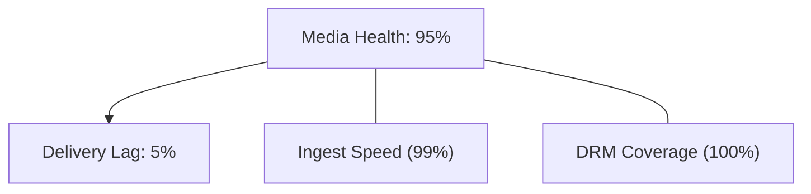

### 8. Identity & RBAC for Media Governance
Managing fine-grained access to raw production assets, transcoding settings, and monetization dashboards between Producers, Media Engineers, and Rights Managers.

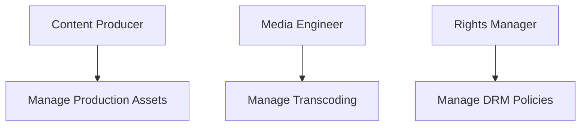

### 9. IaC Deployment: Media-LZ-as-Code Framework
Using modular Terraform to deploy and manage the versioned distribution of the media tracking hubs, rendering farms, and forensic metadata lakes.

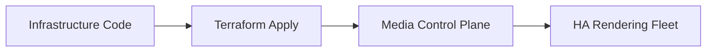

### 10. AIOps Content Quality & Drift Validation Flow
Using advanced analytics to identify video artifacts (black frames, audio sync issues) or metadata mismatches during the automated supply chain process.

```mermaid
graph LR
    Video["Processed Video"] --> Analyzer["Quality Validation Bot"]
    Analyzer -->|Artifact| Alert["QA Rejection Alert"]
    Analyzer -->|Passed| Pass["Safe for Distribution"]
```

### 11. Metadata Lake for Forensic Media Audit
Storing long-term records of every asset ingested, every transcoding decision, and every delivery event for institutional record-keeping and compliance auditing.

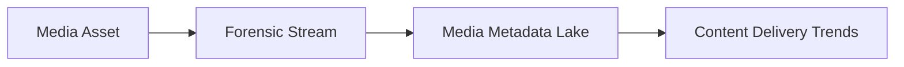

---

## 🏛️ Core Media Pillars

1.  **Unified Supply Chain Orchestration**: Maximizing delivery speed by automating the full ingestion-to-distribution lifecycle.
2.  **High-Precision Transcoding Control**: Delivering premium quality across all device types through automated ABR packaging.
3.  **Geo-Distributed Edge Resiliency**: Minimizing buffering through intelligent multi-CDN traffic steering.
4.  **Zero-Trust Content Protection**: Securing high-value intellectual property through real-time DRM enforcement.
5.  **Autonomous Metadata Enrichment**: Enabling global asset discoverability through AI-driven tagging and indexing.
6.  **Full Media Auditability**: Immutable recording of every asset transformation and delivery event for institutional forensics.

---

## 🛠️ Technical Stack & Implementation

### Media Engine & APIs
*   **Framework**: Python 3.11+ / FastAPI.
*   **Transcoding Core**: FFmpeg and Shaka Packager integration for ABR and DRM.
*   **MAM Hub**: Custom Python-based asset registry with PostgreSQL backend.
*   **Persistence**: PostgreSQL (Metadata Lake) and Redis (Live Job Queue).
*   **Auth Orchestrator**: Federated OIDC/SAML for least-privilege media asset access.

### Content Intelligence Dashboard (UI)
*   **Framework**: React 18 / Vite.
*   **Theme**: Dark, Purple, Slate (Modern high-fidelity media aesthetic).
*   **Visualization**: Recharts for streaming throughput, concurrent viewer counts, and QoE analytics.

### Infrastructure & DevOps
*   **Runtime**: AWS EKS or Azure Kubernetes Service (AKS).
*   **Storage Plane**: High-performance object storage (S3/GCS) with global replication.
*   **IaC**: Modular Terraform for deploying the media landing zone and processing fleet.

---

## 🏗️ IaC Mapping (Module Structure)

| Module | Purpose | Real Services |
| :--- | :--- | :--- |
| **`infrastructure/media_hub`** | Central management plane | EKS, PostgreSQL, Redis |
| **`infrastructure/rendering`** | Distributed processing fleet | Spot EC2, Lambda, FFmpeg |
| **`infrastructure/cdn`** | Edge distribution & DRM | CloudFront, Akamai, Widevine |
| **`infrastructure/auditing`** | Forensic media sinks | S3, Athena, Quicksight |

---

## 🚀 Deployment Guide

### Local Principal Environment
```bash
# Clone the media platform
git clone https://github.com/devopstrio/media-entertainment-lz.git
cd media-entertainment-lz

# Configure environment
cp .env.example .env

# Launch the Media stack
make init

# Trigger a mock media ingestion and transcoding simulation
make simulate-media
```

Access the Content Intelligence Hub at `http://localhost:3000`.

---

## 📜 License
Distributed under the MIT License. See `LICENSE` for more information.

---
<div align="center">
  <p>© 2026 Devopstrio. All rights reserved.</p>
</div>
