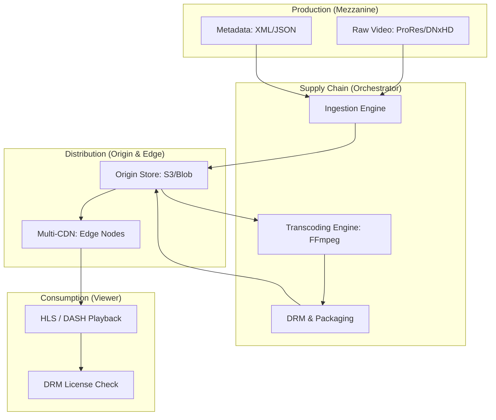
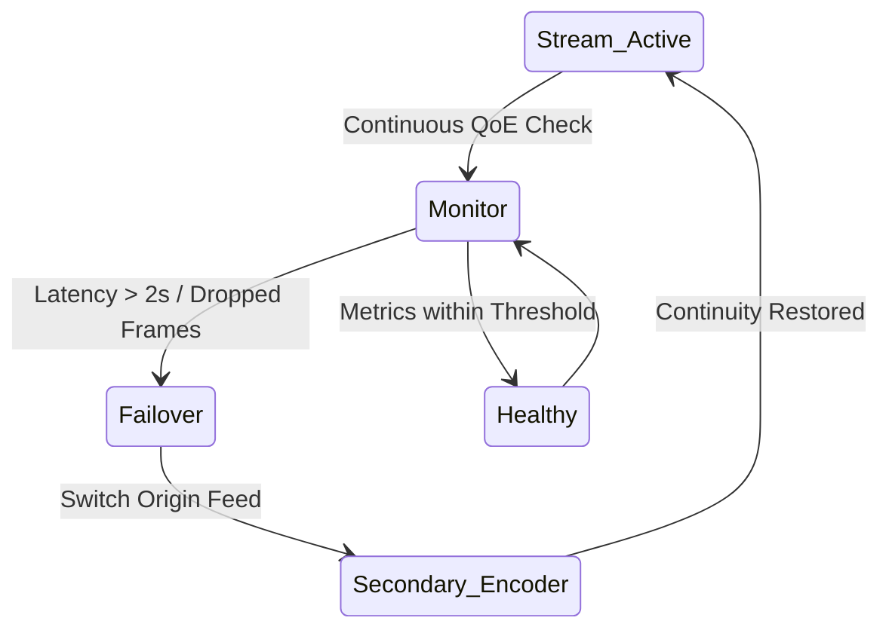

# Architecture & Media Supply Chain Diagrams

## 11. End-to-End Media Supply Chain (Detailed)
*The flow from production mezzanine to edge delivery.*



## 13. "Adaptive Bitrate" (ABR) Logic
```mermaid
graph LR
    Viewer[Viewer Network: 20 Mbps] --> Selection[ABR Logic]
    Selection --> High[Manifest: 1080p / 6 Mbps]
    Viewer2[Viewer Network: 2 Mbps] --> Selection
    Selection --> Low[Manifest: 480p / 1 Mbps]
    Note right of Selection: Dynamic Quality Switching
```

## 20. Live Stream failover Cluster

