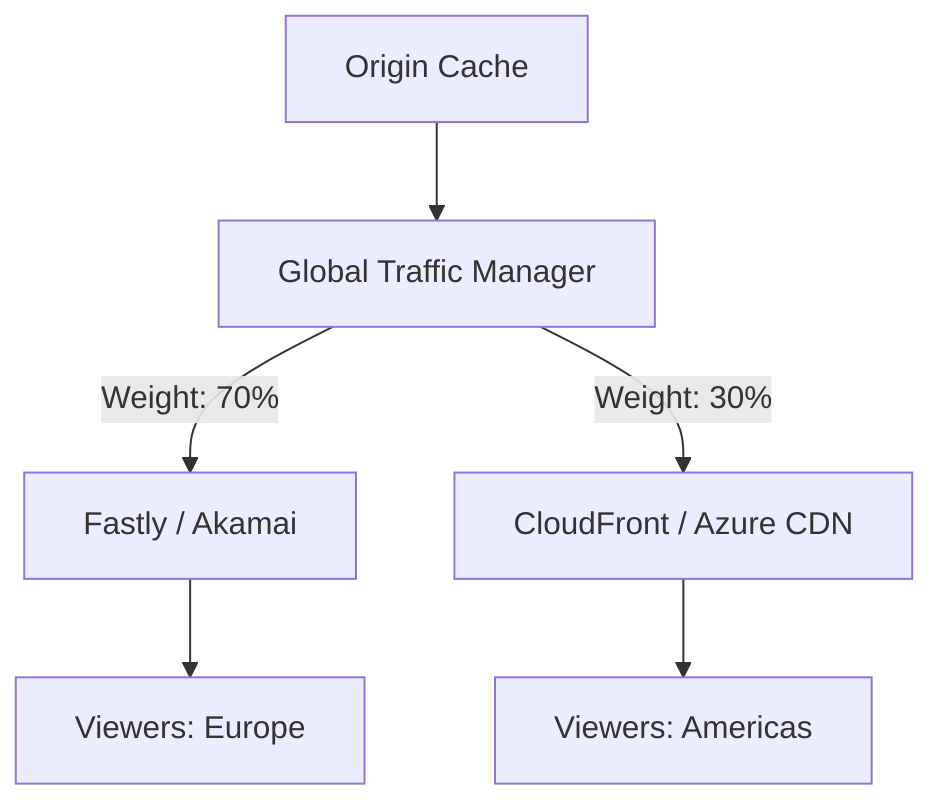
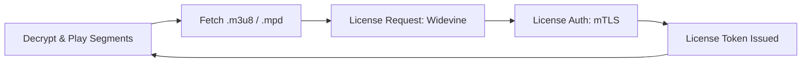
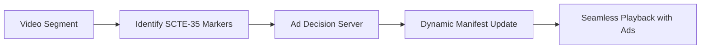

# Streaming & Security Diagrams

## 31. Multi-CDN Distribution Topology

```mermaid
graph TD
    Origin[Origin Cache] --> Global[Global Traffic Manager]
    Global -->|Weight: 70%| CDN1[Fastly / Akamai]
    Global -->|Weight: 30%| CDN2[CloudFront / Azure CDN]
    CDN1 --> Europe[Viewers: Europe]
    CDN2 --> Americas[Viewers: Americas]
```

## 34. DRM License Acquisition Flow

```mermaid
graph LR
    Player[Player Engine] --> Manifest[Fetch .m3u8 / .mpd]
    Manifest --> License[License Request: Widevine]
    License --> Server[License Auth: mTLS]
    Server --> Token[License Token Issued]
    Token --> Player[Decrypt & Play Segments]
```

## 40. SSAI (Server-Side Ad Insertion) Workflow

```mermaid
graph LR
    Content[Video Segment] --> AdBreaks[Identify SCTE-35 Markers]
    AdBreaks --> AdServer[Ad Decision Server]
    AdServer --> ManifestStitch[Dynamic Manifest Update]
    ManifestStitch --> Player[Seamless Playback with Ads]
```
